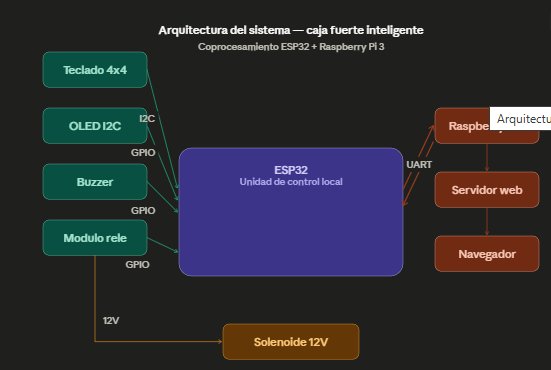

# 🔐 Caja Fuerte Inteligente - Sistemas Embebidos II

## Descripción General

Sistema de caja fuerte inteligente basado en coprocesamiento entre un **ESP32** y una **Raspberry Pi 3**, desarrollado como proyecto final para la materia de Sistemas Embebidos II. El sistema implementa una arquitectura distribuida donde el ESP32 actúa como unidad de control local y la Raspberry Pi como unidad de monitoreo y control remoto.

---

## Arquitectura del Sistema

### Distribución de tareas

| Dispositivo | Responsabilidades |
|-------------|-------------------|
| ESP32 | Control del teclado, OLED, buzzer, relé y solenoide |
| Raspberry Pi 3 | Servidor web, interfaz de control remoto, historial de eventos |

---

## Componentes de Hardware

| Componente | Descripción |
|-----------|-------------|
| ESP32 WROOM-32 | Microcontrolador principal |
| Raspberry Pi 3 | Computador de placa única |
| Teclado matricial 4x4 | Entrada de contraseña |
| Pantalla OLED 0.96" I2C | Visualización de estado |
| Módulo relé 2 canales | Control del solenoide |
| Solenoide 12V | Mecanismo de cerradura |
| Buzzer activo 5V | Alertas sonoras |
| Fuente 12V 1A | Alimentación del solenoide |
| PCB personalizada | Circuito impreso fabricado con método de transferencia térmica |

---

## Conexiones de Hardware

### ESP32 → OLED I2C
| ESP32 | OLED |
|-------|------|
| GPIO21 (SDA) | SDA |
| GPIO22 (SCL) | SCL |
| 3.3V | VCC |
| GND | GND |

### ESP32 → Teclado 4x4
| ESP32 | Teclado |
|-------|---------|
| GPIO27 | R1 |
| GPIO14 | R2 |
| GPIO12 | R3 |
| GPIO13 | R4 |
| GPIO32 | C1 |
| GPIO33 | C2 |
| GPIO25 | C3 |
| GPIO26 | C4 |

### ESP32 → Módulo Relé
| ESP32 | Relé |
|-------|------|
| GPIO18 | IN1 |
| 5V (VIN) | VCC |
| GND | GND |

### ESP32 → Raspberry Pi (UART)
| ESP32 | Raspberry Pi |
|-------|-------------|
| TX2 (GPIO17) | Pin 10 (RX) |
| RX2 (GPIO16) | Pin 8 (TX) |
| GND | Pin 6 (GND) |

### Relé → Solenoide
| Relé | Solenoide/Fuente |
|------|-----------------|
| COM | Positivo fuente 12V |
| NO | Cable positivo solenoide |
| - | Negativo fuente → GND común |

---

## Funcionalidades

### Control local (ESP32 + Teclado)
- ✅ Ingreso de contraseña mediante teclado 4x4
- ✅ Visualización de estado en pantalla OLED
- ✅ Bloqueo automático tras 3 intentos fallidos (10 segundos)
- ✅ Apertura de caja mediante solenoide
- ✅ Alertas sonoras con buzzer
- ✅ Cambio de contraseña desde teclado (tecla A + clave actual + nueva clave)

### Control remoto (Raspberry Pi + Web)
- ✅ Interfaz web accesible desde cualquier dispositivo en la red
- ✅ Apertura remota con autenticación por contraseña
- ✅ Visualización del estado en tiempo real
- ✅ Cambio de contraseña (requiere contraseña actual)
- ✅ Historial de eventos con hora
- ✅ Contador de intentos fallidos
- ✅ Sincronización bidireccional de contraseña entre ESP32 y web

### Protocolo de comunicación UART
| Comando | Dirección | Descripción |
|---------|-----------|-------------|
| `OPEN` | RPi → ESP32 | Abrir caja |
| `PASS:nueva` | RPi → ESP32 | Cambiar contraseña |
| `ABIERTO` | ESP32 → RPi | Notificar apertura |
| `CERRADO` | ESP32 → RPi | Notificar cierre |
| `BLOQUEADO` | ESP32 → RPi | Notificar bloqueo |
| `DESBLOQUEADO` | ESP32 → RPi | Notificar desbloqueo |
| `PASS_OK` | ESP32 → RPi | Confirmar cambio de clave |
| `NEWPASS:clave` | ESP32 → RPi | Nueva clave desde teclado |

---

## PCB

La placa PCB fue diseñada en **KiCad 9.0** y fabricada mediante el método de **transferencia térmica** con cloruro férrico. Incluye conectores para todos los módulos externos.

---

## Tecnologías Utilizadas

- **ESP32** con framework Arduino (Espressif)
- **Python 3** con Flask para el servidor web
- **KiCad 9.0** para diseño de PCB
- **Protocolo UART** para comunicación entre dispositivos
- **Protocolo I2C** para pantalla OLED
- **HTML/CSS/JavaScript** para interfaz web

---

## Estudiante

**Valeria Alejandra Hoyos Tovar** 

---

## Datos

**Materia:** Sistemas Embebidos II
**Docente:** Ing. Alan Cornejo 
